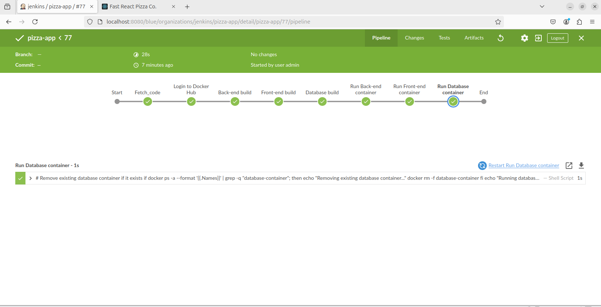
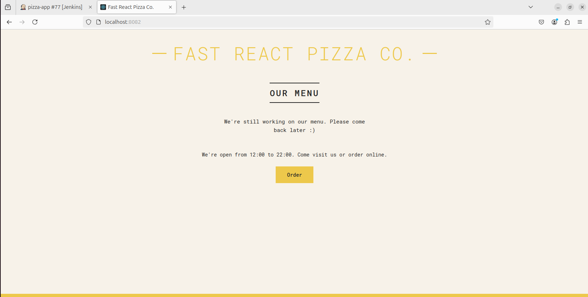

Thanks for sharing the Jenkins pipeline script! Based on your pipeline and the details you provided, here's an updated README file:

---

# DevOps Task: Automated Deployment with Jenkins and Docker

## Overview

This repository contains all the necessary files and configurations to automate the deployment of a full-stack application using Jenkins and Docker. The goal is to create a seamless pipeline for building, deploying, and managing applications in a scalable manner.

## Repository Structure

- **Dockerfile**: Defines the Docker images for the front-end, back-end, and database components.
- **application files**: Contains the source code of the application, including front-end, back-end, and database scripts.
- **Jenkinsfile**: Defines the CI/CD pipeline for Jenkins.

## Prerequisites

- Docker
- Jenkins
- GitHub account with a private repository

## Steps to Set Up

### 1. Push Code to GitHub

Push the full-stack application code to your private GitHub repository.

### 2. Write Dockerfiles

Create separate `Dockerfile`s for the front-end, back-end, and database components and push them to your repository.

### 3. Create a Docker Network

Create a custom Docker network to run the containers:
```bash
docker network create pizza-app-network
```

### 4. Set Up Jenkins Pipeline

Set up a Jenkins pipeline to automate the following steps:

1. **Fetch Code from GitHub**: Configure Jenkins to pull code from your GitHub repository using a credentials token.
2. **Login to Docker Hub**: Jenkins logs in to Docker Hub using your credentials.
3. **Build Docker Images**: Use the Dockerfiles to build Docker images for the front-end, back-end, and database components.
4. **Push Docker Images to Docker Hub**: Push the built Docker images to Docker Hub.
5. **Run Docker Containers**: Run the Docker containers for each component within the custom network, ensuring they are properly configured and connected.

### Jenkins Configuration

To automate the deployment process, configure Jenkins as follows:

1. **Create a New Pipeline**: Set up a new pipeline job in Jenkins.
2. **Configure Pipeline Script**: Use the `Jenkinsfile` provided in this repository to define the pipeline stages.

### Successful Pipeline

Here’s a screenshot of the successful Jenkins pipeline:




## Running the Application

After setting everything up, you can run your application. Here are screenshots of the application running on [http://localhost:8082](http://localhost:8082):



## Conclusion

By following the steps outlined in this README, you will be able to automate the deployment of your full-stack application using Jenkins and Docker. This setup ensures a streamlined and efficient deployment process.

---
